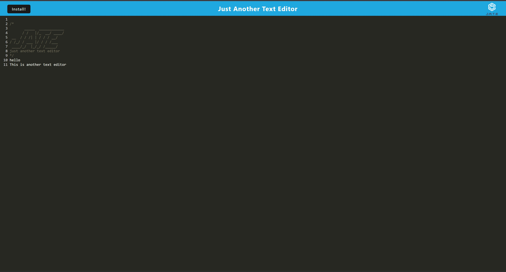

# text-editor

## Description

This application provides a text editor which can be deployed as a desktop application.

## Table of Contents

- [Installation](#installation)
- [Usage](#usage)
- [Credits](#credits)
- [License](#license)
- [How to Contribute](#how%20to%20contribute)
- [Tests](#tests)

## Installation

N/A

## Usage

Please run the application via this [link]
Alternatively, hit the 'Install' button to launch the application on desktop. 
All data are saved in iDB on the browser. 

## Credits

Credit to Coding Bootcamp.
[Source code](https://github.com/coding-boot-camp/cautious-meme)

## License
[MIT](https://opensource.org/licenses/MIT)

## How to Contribute

N/A

## Tests

N/A